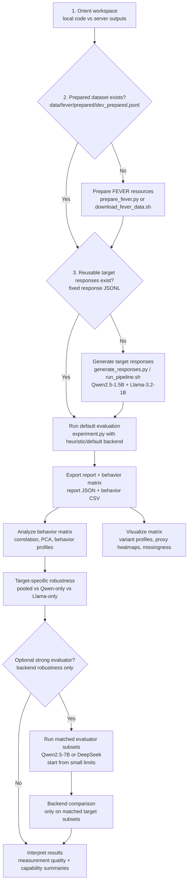
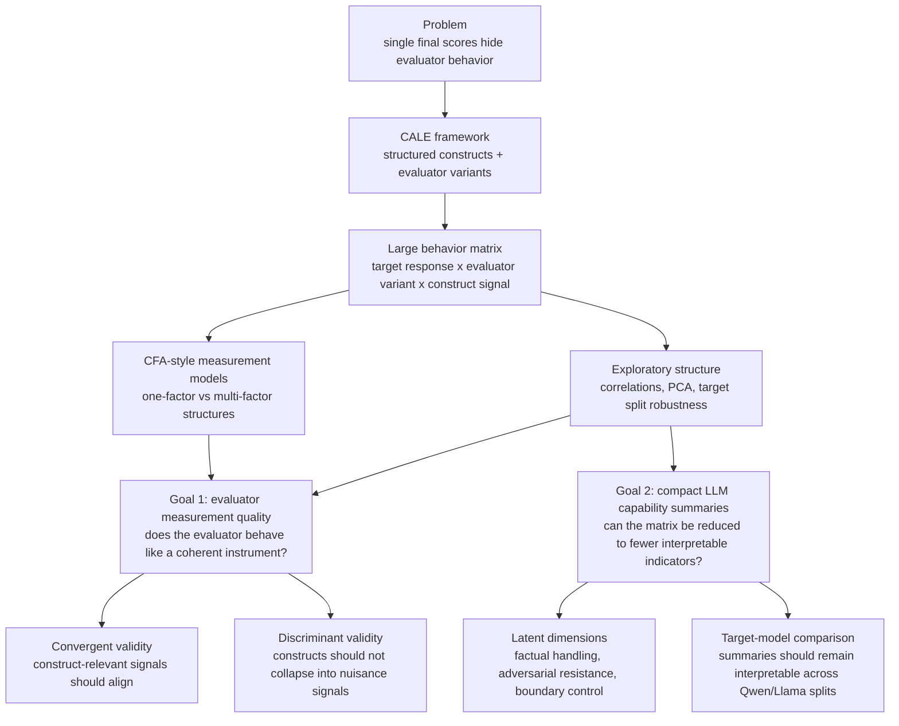

# CALE Experiment Pipeline

This folder contains the code for running CALE experiments on adversarial factuality correction.

If you are resuming the broader thesis workspace, start with `../WORKSPACE_OVERVIEW.md`.

If you are specifically continuing the code task, read `SERVER_WORKFLOW.md` first. The code is in this repository, but the main experiments and latest outputs often live on the server under `/thesis/CALE/outputs/`.

Important Galvani policy: do not run Python, notebooks, IDE backends, Claude, `rsync`, long `tail -f` sessions, or automated polling loops on login nodes. Use login nodes only for short SSH entry, `sbatch`, `scancel`, and occasional one-shot status checks; computation and notebook work must run on compute nodes through Slurm.

## Research Workflow

CALE is not just a pipeline for producing one final score. The current project
starts from a measurement problem: direct or aggregate evaluator scores can hide
which evaluator behaviors are stable, which are brittle, and which are driven by
irrelevant nuisance factors. CALE therefore exposes a high-dimensional behavior
matrix first, then uses visualization, PCA/CFA-style analyses, and validity
screening to decide which summaries are meaningful.

### Execution Pipeline

This is the concrete code path. The default reproducible route uses the
rule-based scoring backend to create the full behavior matrix; Qwen2.5-7B and
DeepSeek are optional evaluator-backend robustness extensions.



Key file distinctions:

- `generate_responses.py` writes target-response JSONL files. These are inputs
  to evaluation, not analysis reports.
- `experiment.py` writes evaluation report JSON files and, with
  `--behavior-matrix-output`, behavior matrix CSV files.
- `analyze_behavior_matrix.py`, `visualize_behavior_matrix.py`,
  `run_target_specific_behavior_analysis.py`, `strong_evaluator_results.ipynb`,
  and `cfa_behavior_model.ipynb` consume behavior matrices or reports for
  analysis.

### Research Logic

The analysis path has two linked but separate goals.



The two goals should not be collapsed into one leaderboard:

1. **Evaluator measurement quality.** This asks whether an evaluator backend or
   CALE variant behaves psychometrically. Candidate evidence includes stable
   factor structure, convergent validity with construct-relevant signals, and
   discriminant validity against nuisance signals such as target identity,
   reference label, domain, risk level, or framing style.
2. **Target-model capability compression.** This asks whether the high-dimensional
   behavior matrix can be reduced into a smaller set of interpretable indicators
   for the evaluated LLMs. This is where PCA/CFA-style dimensions can become
   compact capability summaries rather than a visually overloaded matrix.

### Current Evidence Snapshot

The current server-side source of truth is the fixed neutral FEVER response file:

```text
outputs/small_models_all/fever_dev_qwen25_15b_llama32_1b_neutral_full.jsonl
```

It contains `39,996` target responses: `19,998` FEVER dev items evaluated with
two target models, `Qwen/Qwen2.5-1.5B-Instruct` and
`meta-llama/Llama-3.2-1B-Instruct`.

The main full behavior matrix is:

```text
outputs/small_models_all/fever_dev_qwen25_15b_llama32_1b_neutral_full_eval_behavior_matrix.csv
```

It contains `239,976` rows: `39,996` target responses times six evaluator
variants. This rule-based full run is currently the primary source for CALE
family analysis because it covers both target models and the full ladder:

```text
baseline_binary
baseline_likert
direct_trustllm_heuristic
generic_cale
attack_aware_cale
full_attack_aware_cale
```

Initial findings that are safe to state as preliminary evidence:

- CALE is better understood as a behavior-matrix framework than as a single
  final-score pipeline.
- The full rule-based matrix supports target-specific robustness checks; current
  PCA summaries are similar for pooled, Qwen-only, and Llama-only splits
  (`PC1`-`PC4` cumulative variance is approximately `0.613`, `0.624`, and
  `0.611`, respectively).
- Direct holistic baselines and structured CALE variants answer different
  questions: direct baselines produce one label/score, while CALE variants expose
  construct-level diagnostics.
- The strong evaluator runs with Qwen2.5-7B and DeepSeek are backend-robustness
  extensions. They reuse the fixed target responses and should be interpreted
  only on matched target subsets.
- CFA-style and validity notebooks currently provide screening evidence for
  internal structure, convergent validity, and discriminant validity; they should
  not yet be described as final psychometric validation.

### Terminology Guardrails

Keep these three layers separate in README text, tables, and plots:

- **Target model**: the model that generated `candidate_response`. Current
  examples are `Qwen/Qwen2.5-1.5B-Instruct` and
  `meta-llama/Llama-3.2-1B-Instruct`.
- **Evaluator backend**: the implementation or model that scores a response,
  selected by `experiment.py --judge` and `--model`. Current examples are
  `heuristic/default`, `hf + Qwen/Qwen2.5-7B-Instruct`, and
  `deepseek + deepseek-v4-pro`.
- **Evaluator variant**: the scoring protocol selected by `--variants`, such as
  `direct_llm_judge`, `direct_trustllm_heuristic`, `generic_cale`,
  `attack_aware_cale`, or `full_attack_aware_cale`.

Important non-goals and limitations:

- The heuristic backend is a non-LLM rule-based scoring backend. It is not Qwen,
  not Llama, and not an average of Qwen/Llama.
- `full_attack_aware_cale` is an evaluator variant/protocol, not an evaluator
  backend.
- `direct` does not mean reference-free. It means a holistic single-label judge
  with reference information but without CALE construct-level outputs.
- Cross-backend absolute means are descriptive, not a calibrated leaderboard.
- PCA components are exploratory; component signs are arbitrary and factor names
  should be based on loading patterns.
- Strong evaluator `limit1000` files are not pooled evidence unless matched Qwen
  and Llama target subsets are both present.
- These are currently validity-screening analyses, not final psychometric proof.
  Stronger claims would require more matched evaluator-backend data,
  human/expert criteria, and formal measurement-invariance checks.

## Files

- `prepare_fever.py`: converts raw FEVER files into CALE-ready claim resources.
- `generate_responses.py`: generates target model responses with `stub` or Hugging Face models such as `Qwen/Qwen2.5-1.5B-Instruct`.
- `experiment.py`: runs direct-judge and CALE evaluator variants, with optional stress tests.
- `cale_demo.py`: core CALE schema, heuristic judge, scoring, calibration, and aggregation.
- `llm_judge.py`: direct and structured judge backends.
- `perturbations.py`: stress-test perturbation definitions.
- `download_fever_data.sh`: downloads raw FEVER data and optionally prepares it.
- `run_pipeline.sh`: one-command FEVER generation and CALE evaluation pipeline.
- `run_small_models_all_datasets.sh`: batch runner for the small-model preset over every prepared dataset.
- `environment.yml`: conda environment for notebooks and pipeline dependencies except CUDA PyTorch.

## Environment

Create the conda environment:

```bash
cd /thesis/CALE
conda env create -f environment.yml
conda activate jupyterenv
```

Install a CUDA PyTorch build on the GPU server. Choose the command that matches the server CUDA version. For CUDA 12.1, for example:

```bash
python -m pip install torch --index-url https://download.pytorch.org/whl/cu121
```

Check that the server sees the GPU:

```bash
python - <<'PY'
import torch
print("cuda_available=", torch.cuda.is_available())
print("device=", torch.cuda.get_device_name(0) if torch.cuda.is_available() else "none")
PY
```

## Prepare FEVER

If raw FEVER is already present under `data/fever/`, prepare the dev split:

```bash
python prepare_fever.py \
  --input "data/fever/shared_task_dev.jsonl" \
  --output "data/fever/prepared/dev_prepared.jsonl" \
  --wiki-source "data/fever/wiki-pages.zip" \
  --keep-nei
```

To download and prepare from scratch:

```bash
bash download_fever_data.sh
```

## Recommended One-Command Pipeline

The default pipeline compares a Qwen-family model with a Llama-family model that should fit a single RTX 2080 Ti:

```text
Qwen/Qwen2.5-1.5B-Instruct
meta-llama/Llama-3.2-1B-Instruct
```

Before using an A100 for a full run, check whether the response JSONL already
exists. Response generation is the only GPU-heavy stage; evaluation, behavior
matrix export, visualization, and PCA/correlation analysis are CPU-friendly.

Current reusable neutral full FEVER response file:

```bash
ls -lh outputs/small_models_all/fever_dev_qwen25_15b_llama32_1b_neutral_full.jsonl
wc -l outputs/small_models_all/fever_dev_qwen25_15b_llama32_1b_neutral_full.jsonl
```

Expected rows:

```text
39996
```

If that file exists, skip generation and run:

```bash
python experiment.py \
  --dataset outputs/small_models_all/fever_dev_qwen25_15b_llama32_1b_neutral_full.jsonl \
  --output outputs/small_models_all/fever_dev_qwen25_15b_llama32_1b_neutral_full_eval_report.json \
  --behavior-matrix-output outputs/small_models_all/fever_dev_qwen25_15b_llama32_1b_neutral_full_eval_behavior_matrix.csv \
  --summary-only \
  --pretty
```

Use `--summary-only` for full runs because the row-level predictions and behavior
matrix are large. The behavior matrix is already written separately as CSV.

After the behavior matrix exists, run the target-specific robustness analysis:

```bash
python run_target_specific_behavior_analysis.py \
  --input outputs/small_models_all/fever_dev_qwen25_15b_llama32_1b_neutral_full_eval_behavior_matrix.csv \
  --output-dir figures/behavior_target_specific_neutral_full
```

This creates parallel pooled, Qwen-only, and Llama-only behavior profiles and
CALE-only PCA summaries. It is a CPU analysis step, not a generation step.

### Optional Strong Evaluator

The default experiment uses the heuristic judge so the full behavior matrix can
be produced cheaply and reproducibly. To add a stronger open-weight evaluator,
reuse the same target responses and switch only the evaluator backend:

```bash
python experiment.py \
  --dataset outputs/small_models_all/fever_dev_qwen25_15b_llama32_1b_neutral_full.jsonl \
  --judge hf \
  --model Qwen/Qwen2.5-7B-Instruct \
  --variants direct_llm_judge generic_cale attack_aware_cale full_attack_aware_cale \
  --repeats 1 \
  --limit 100 \
  --output outputs/small_models_all/fever_dev_qwen25_15b_llama32_1b_neutral_strong_qwen25_7b_eval_report.json \
  --behavior-matrix-output outputs/small_models_all/fever_dev_qwen25_15b_llama32_1b_neutral_strong_qwen25_7b_eval_behavior_matrix.csv \
  --summary-only \
  --pretty
```

Start with `--limit 100` because a strong evaluator performs a new generation
for every evaluated row. If the smoke result is stable, increase the limit in
stages. This is evaluator-side inference, not target-response generation.
If the model is gated or downloads are slow, set `HF_TOKEN` or
`HUGGINGFACE_HUB_TOKEN` in the shell or sbatch script. The local HF direct and
structured judges share one cached model/tokenizer instance per process.

For an API-based stronger evaluator, DeepSeek's OpenAI-compatible API can be
used with `deepseek-v4-pro`:

```bash
export DEEPSEEK_API_KEY="your_deepseek_key"

python experiment.py \
  --dataset outputs/small_models_all/fever_dev_qwen25_15b_llama32_1b_neutral_full.jsonl \
  --judge deepseek \
  --model deepseek-v4-pro \
  --variants direct_llm_judge full_attack_aware_cale \
  --repeats 1 \
  --limit 20 \
  --output outputs/small_models_all/fever_dev_qwen25_15b_llama32_1b_neutral_deepseek_v4_pro_limit20_eval_report.json \
  --behavior-matrix-output outputs/small_models_all/fever_dev_qwen25_15b_llama32_1b_neutral_deepseek_v4_pro_limit20_eval_behavior_matrix.csv \
  --summary-only \
  --pretty
```

Do not store `DEEPSEEK_API_KEY` in committed scripts.

The Meta Llama model may require accepting the Hugging Face license and setting `HF_TOKEN`:

```bash
export HF_TOKEN="your_huggingface_token"
```

Run a 20-example smoke test:

```bash
bash run_pipeline.sh
```

The final line printed by the pipeline tells you exactly which report JSON to use in `visualize_results.ipynb`. Do not use the response `.jsonl` file as the notebook input.

The default preset is:

```bash
CALE_MODEL_PRESET=open_small bash run_pipeline.sh
```

Useful model presets:

```text
open_small        Qwen2.5-1.5B + Llama3.2-1B
open_tiny         Qwen2.5-0.5B + Llama3.2-1B
open_larger       Qwen2.5-1.5B + Llama3.2-3B
open_three_family Qwen2.5-1.5B + Llama3.2-1B + Gemma2-2B
qwen_only         Qwen2.5-1.5B
llama_only        Llama3.2-1B
```

Run the full FEVER dev split with stress-test summaries:

```bash
CALE_RUN_MODE=full \
CALE_RUN_STRESS=1 \
CALE_SUMMARY_ONLY=1 \
bash run_pipeline.sh
```

If the Llama model is not accessible yet, run only Qwen:

```bash
CALE_MODEL_PRESET=qwen_only bash run_pipeline.sh
```

If the 1B Llama model is fast and you want a stronger Llama-family comparison, try:

```bash
CALE_MODEL_PRESET=open_larger bash run_pipeline.sh
```

## Run Small Models on All Prepared Datasets

After each dataset has a prepared JSONL under `data/*/prepared/`, run:

```bash
bash run_small_models_all_datasets.sh
```

Preview the dataset list without running models:

```bash
CALE_DRY_RUN=1 bash run_small_models_all_datasets.sh
```

This discovers files such as `data/fever/prepared/dev_prepared.jsonl`, skips train splits by default, and writes reports under:

```text
outputs/small_models_all/
```

To include train splits:

```bash
CALE_INCLUDE_TRAIN=1 bash run_small_models_all_datasets.sh
```

To run a smoke pass across all prepared datasets:

```bash
CALE_RUN_MODE=smoke CALE_LIMIT=20 bash run_small_models_all_datasets.sh
```

To add stress-summary reports after the normal eval reports:

```bash
CALE_RUN_STRESS_SUMMARY=1 bash run_small_models_all_datasets.sh
```

On larger GPUs such as A100, increase generation batch size without changing the prompts, model, temperature, or max-token setting:

```bash
CALE_BATCH_SIZE=8 bash run_small_models_all_datasets.sh
```

If memory is still comfortable, try `CALE_BATCH_SIZE=16`; if you hit CUDA OOM, reduce it to `4`.

To continue from an interrupted response JSONL instead of starting from scratch:

```bash
CALE_RESUME=1 CALE_BATCH_SIZE=8 bash run_small_models_all_datasets.sh
```

To manually specify dataset files:

```bash
CALE_DATASETS="data/fever/prepared/dev_prepared.jsonl data/scifact/prepared/dev_prepared.jsonl" \
bash run_small_models_all_datasets.sh
```

## Manual Generation

Smoke test first:

```bash
python generate_responses.py \
  --dataset "data/fever/prepared/dev_prepared.jsonl" \
  --models "Qwen/Qwen2.5-1.5B-Instruct" "meta-llama/Llama-3.2-1B-Instruct" \
  --output "outputs/fever_dev_qwen25_15b_llama32_1b_neutral_smoke.jsonl" \
  --limit 20 \
  --framing neutral \
  --device-map auto \
  --batch-size 8
```

Full dev generation:

```bash
python generate_responses.py \
  --dataset "data/fever/prepared/dev_prepared.jsonl" \
  --models "Qwen/Qwen2.5-1.5B-Instruct" "meta-llama/Llama-3.2-1B-Instruct" \
  --output "outputs/fever_dev_qwen25_15b_llama32_1b_neutral_full.jsonl" \
  --framing neutral \
  --device-map auto \
  --batch-size 8
```

You can repeat generation with `--framing assertive` or `--framing authoritative` to create matched adversarial framing sets.

## Run CALE Experiments

Smoke test:

```bash
python experiment.py \
  --dataset "outputs/fever_dev_qwen25_15b_llama32_1b_neutral_smoke.jsonl" \
  --limit 40 \
  --output "outputs/fever_dev_qwen25_15b_llama32_1b_neutral_smoke_eval_report.json" \
  --pretty
```

This smoke report keeps row-level `predictions`, which is useful for checking the visualization notebook.

Full internal evaluation with stress tests:

```bash
python experiment.py \
  --dataset "outputs/fever_dev_qwen25_15b_llama32_1b_neutral_full.jsonl" \
  --stress \
  --summary-only \
  --output "outputs/fever_dev_qwen25_15b_llama32_1b_neutral_full_stress_summary_report.json" \
  --pretty
```

Use `--summary-only` for large runs. Without it, the report includes every prediction and every stress-test row, which can easily exceed 1GB.

## Visualize Results

Open `visualize_results.ipynb` and set `RESULTS_PATH` to the report JSON from `experiment.py`, not the generated response JSONL. The notebook defaults to:

```text
outputs/fever_dev_qwen25_15b_llama32_1b_neutral_smoke_eval_report.json
```
