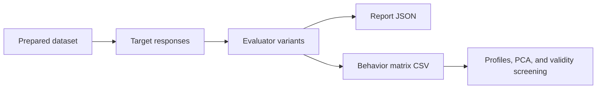

# CALE: Construct-Aware LLM Evaluation

CALE is a research pipeline for evaluating how language-model responses handle
adversarially framed factual claims. Instead of reducing evaluation to one final
score, CALE exports a behavior matrix: one row per target response, evaluator
variant, and construct-level signal.

The current implementation focuses on FEVER-style factuality correction, while
keeping dataset preparation, target-response generation, evaluator backends, and
analysis scripts separate enough to reuse independently.


```mermaid
flowchart LR
    A["Prepared dataset"] --> B["Target responses"]
    B --> C["Evaluator variants"]
    C --> D["Report JSON"]
    C --> E["Behavior matrix CSV"]
    E --> F["Profiles, PCA, and validity screening"]
```

## What This Repository Contains

```text
cale/          Core generation, evaluation, judge, and perturbation code
examples/      Dataset conversion helpers
workflows/     Shell wrappers for data download and pipeline runs
analysis/      Behavior-matrix analysis and figure/table builders
notebooks/     Exploratory and publication-oriented notebooks
```

Generated datasets, responses, reports, behavior matrices, figures, logs,
caches, local environments, and secrets are ignored by git.

## Setup

```bash
conda env create -f environment.yml
conda activate jupyterenv
```

For dependency-layer details, see `ENVIRONMENT_NOTES.md`.

The default heuristic evaluator does not need API keys. Local Hugging Face
generation and stronger evaluator backends may require model access and
credentials. Keep tokens in the environment, not in committed files.

## Data

Download and prepare FEVER data:

```bash
bash workflows/download_fever_data.sh
```

This writes the prepared dev split to:

```text
data/fever/prepared/dev_prepared.jsonl
```

With NEI items kept, the prepared FEVER dev split should contain `19,998` rows.

## Quick Start

Run a small smoke pipeline:

```bash
CALE_MODEL_PRESET=qwen_only CALE_LIMIT=20 bash workflows/run_pipeline.sh
```

The workflow will:

1. Generate target-model responses.
2. Run CALE evaluator variants with the default heuristic judge.
3. Write a report JSON and behavior-matrix CSV under `outputs/`.

The script prints the exact output paths at the end. For all available runtime
options:

```bash
bash workflows/run_pipeline.sh --help
```

Common overrides:

```text
CALE_RUN_MODE=smoke|full
CALE_LIMIT=20
CALE_MODEL_PRESET=open_small|open_tiny|open_larger|open_three_family|qwen_only|llama_only
CALE_BATCH_SIZE=4
CALE_SUMMARY_ONLY=1
CALE_RESUME=1
CALE_SKIP_GENERATION=1
```

`open_small` and Llama/Gemma presets may require accepting the model license on
Hugging Face and setting `HF_TOKEN`.

## Outputs

The main generated files are:

```text
outputs/<run_tag>.jsonl                    Target-model responses
outputs/<run_tag>_eval_report.json         Aggregate evaluation report
outputs/<run_tag>_eval_behavior_matrix.csv Construct-level behavior matrix
```

For full FEVER dev runs with two target models, typical row counts are:

```text
Prepared FEVER dev rows:       19,998
Two-model response rows:       39,996
Six-variant behavior rows:    239,976
```

Large generated artifacts should be distributed separately from the source
repository.

## Advanced Entry Points

Use the modules directly when you already have a prepared dataset or response
file:

```bash
python -m cale.generate_responses --help
python -m cale.experiment --help
```

Use analysis scripts after a behavior matrix exists:

```bash
python analysis/analyze_behavior_matrix.py --help
python analysis/run_target_specific_behavior_analysis.py --help
python analysis/measurement_invariance_screening.py --help
```

The notebooks in `notebooks/` provide more interactive analysis paths for
behavior matrices, strong-evaluator comparisons, and CFA-style validity checks.

## Interpretation Notes

Keep these layers separate when reading results:

- **Target model**: the model that generated `candidate_response`.
- **Evaluator backend**: the judge implementation or model used for scoring.
- **Evaluator variant**: the scoring protocol, such as a baseline, generic CALE,
  attack-aware CALE, or full attack-aware CALE.

CALE is intended for measurement-oriented analysis rather than a simple model
leaderboard. Higher `final_score` is not automatically better measurement
quality; PCA and validity outputs should be treated as exploratory or screening
evidence unless a stronger study design supports the claim.

## License

No license has been specified yet.
