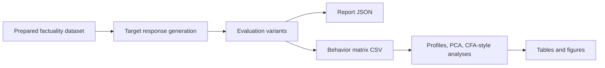

# CALE: Construct-Aware LLM Evaluation

CALE is an experiment pipeline for evaluating how language-model responses handle
adversarially framed factual claims. Instead of treating evaluation as a single
final score, CALE exports a behavior matrix: one row per target response,
evaluator variant, and construct-level signal. That matrix can then be analyzed
for measurement structure, backend agreement, target-model robustness, and
compact diagnostic summaries.

The current implementation is centered on FEVER-style factuality correction, but
the code is organized so prepared JSONL datasets, response generation, evaluator
backends, and analysis notebooks can be run separately.

## What This Repository Contains

- Dataset preparation for FEVER resources.
- Target-response generation with Hugging Face causal language models.
- Direct and construct-aware evaluator variants.
- Heuristic, Hugging Face, OpenAI-compatible, and DeepSeek-compatible judge
  backends.
- Behavior-matrix export for correlation, PCA, target-split, and CFA-style
  analyses.
- Notebooks and scripts for paper-facing tables, figures, and audit outputs.


```mermaid
flowchart LR
    A["Prepared factuality dataset"] --> B["Target response generation"]
    B --> C["Evaluation variants"]
    C --> D["Report JSON"]
    C --> E["Behavior matrix CSV"]
    E --> F["Profiles, PCA, CFA-style analyses"]
    F --> G["Tables and figures"]
```

## Repository Layout

```text
.
├── prepare_fever.py                      # Convert raw FEVER into CALE-ready JSONL
├── generate_responses.py                 # Generate target-model candidate responses
├── experiment.py                         # Run direct and CALE evaluator variants
├── cale_demo.py                          # Core schema, heuristic judge, and scoring
├── llm_judge.py                          # LLM/API judge backends
├── perturbations.py                      # Stress-test perturbation definitions
├── run_pipeline.sh                       # Smoke/full pipeline wrapper
├── run_small_models_all_datasets.sh      # Batch runner over prepared datasets
├── analyze_behavior_matrix.py            # Behavior-matrix statistics and PCA helpers
├── visualize_behavior_matrix.py          # Behavior-matrix visualizations
├── run_target_specific_behavior_analysis.py
├── strong_evaluator_results.ipynb        # Backend-robustness audit notebook
├── cfa_behavior_model.ipynb              # CFA-style measurement notebook
├── figures/                              # Generated tables and figures
├── outputs/                              # Generated responses/reports/matrices
└── environment.yml                       # Conda environment, excluding CUDA PyTorch
```

Large generated artifacts are expected to live under `outputs/`, `figures/`, or
external transfer archives. Do not assume those files are versioned unless a
release or artifact bundle explicitly includes them.

## Installation

Create the conda environment:

```bash
conda env create -f environment.yml
conda activate jupyterenv
```

Install a PyTorch build that matches your machine. For example, on a CUDA 12.1
server:

```bash
python -m pip install torch --index-url https://download.pytorch.org/whl/cu121
```

For CPU-only analysis of existing behavior matrices, the CUDA PyTorch step is
not required. The main scripts use the packages in `environment.yml`; some
research notebooks may require additional exploratory-analysis packages that are
not needed for the smoke pipeline.

Check the runtime:

```bash
python - <<'PY'
import torch
print("cuda_available=", torch.cuda.is_available())
print("device=", torch.cuda.get_device_name(0) if torch.cuda.is_available() else "none")
PY
```

Some target or evaluator models are gated. Accept the relevant model license on
Hugging Face and provide credentials through the shell environment when needed:

```bash
# Example: set HF_TOKEN in your local shell, secret manager, or scheduler env.
```

Never commit API keys or Hugging Face tokens.

## Data

Prepare FEVER dev data from raw FEVER files after downloading the original FEVER
JSONL and wiki archive:

```bash
python prepare_fever.py \
  --input data/fever/shared_task_dev.jsonl \
  --output data/fever/prepared/dev_prepared.jsonl \
  --wiki-source data/fever/wiki-pages.zip \
  --keep-nei
```

Or download and prepare FEVER in one step:

```bash
bash download_fever_data.sh
```

The expected prepared FEVER dev split has `19,998` rows when NEI items are kept.
You can verify a prepared file with:

```bash
wc -l data/fever/prepared/dev_prepared.jsonl
```

## Quick Start

Run a small smoke test:

```bash
bash run_pipeline.sh
```

The default smoke run uses:

```text
CALE_RUN_MODE=smoke
CALE_LIMIT=20
CALE_MODEL_PRESET=open_small
CALE_FRAMING=neutral
```

The final pipeline output tells you which report JSON to inspect. Use the report
JSON for result notebooks, not the generated response JSONL.

Useful model presets:

```text
open_small        Qwen2.5-1.5B + Llama3.2-1B
open_tiny         Qwen2.5-0.5B + Llama3.2-1B
open_larger       Qwen2.5-1.5B + Llama3.2-3B
open_three_family Qwen2.5-1.5B + Llama3.2-1B + Gemma2-2B
qwen_only         Qwen2.5-1.5B
llama_only        Llama3.2-1B
```

Examples:

```bash
CALE_MODEL_PRESET=qwen_only bash run_pipeline.sh
CALE_RUN_MODE=smoke CALE_LIMIT=50 CALE_BATCH_SIZE=4 bash run_pipeline.sh
CALE_RUN_MODE=full CALE_SUMMARY_ONLY=1 bash run_pipeline.sh
```

Response generation is the GPU-heavy stage. Evaluation with the default
heuristic backend, behavior-matrix export, visualization, and PCA/correlation
analysis are CPU-friendly.

## Manual Workflow

Generate target responses:

```bash
python generate_responses.py \
  --dataset data/fever/prepared/dev_prepared.jsonl \
  --models Qwen/Qwen2.5-1.5B-Instruct meta-llama/Llama-3.2-1B-Instruct \
  --output outputs/fever_dev_qwen25_15b_llama32_1b_neutral_smoke.jsonl \
  --limit 20 \
  --framing neutral \
  --device-map auto \
  --batch-size 4
```

Evaluate those responses and export a behavior matrix:

```bash
python experiment.py \
  --dataset outputs/fever_dev_qwen25_15b_llama32_1b_neutral_smoke.jsonl \
  --output outputs/fever_dev_qwen25_15b_llama32_1b_neutral_smoke_eval_report.json \
  --behavior-matrix-output outputs/fever_dev_qwen25_15b_llama32_1b_neutral_smoke_eval_behavior_matrix.csv \
  --pretty
```

For large runs, add `--summary-only` so the report omits row-level predictions:

```bash
python experiment.py \
  --dataset outputs/fever_dev_qwen25_15b_llama32_1b_neutral_full.jsonl \
  --output outputs/fever_dev_qwen25_15b_llama32_1b_neutral_full_eval_report.json \
  --behavior-matrix-output outputs/fever_dev_qwen25_15b_llama32_1b_neutral_full_eval_behavior_matrix.csv \
  --summary-only \
  --pretty
```

Run target-specific robustness analysis after a behavior matrix exists:

```bash
python run_target_specific_behavior_analysis.py \
  --input outputs/fever_dev_qwen25_15b_llama32_1b_neutral_full_eval_behavior_matrix.csv \
  --output-dir figures/behavior_target_specific_neutral_full
```

## Evaluator Variants and Backends

Keep these layers separate when interpreting results:

- **Target model**: the model that generated `candidate_response`.
- **Evaluator backend**: the implementation or model that scores responses,
  selected by `experiment.py --judge` and `--model`.
- **Evaluator variant**: the scoring protocol selected by `--variants`.

Common evaluator variants include:

```text
baseline_binary
baseline_likert
direct_trustllm_heuristic
direct_llm_judge
generic_cale
attack_aware_cale
full_attack_aware_cale
```

The default `heuristic` backend is rule-based and reproducible. To run a stronger
Hugging Face evaluator on a small matched subset:

```bash
python experiment.py \
  --dataset outputs/fever_dev_qwen25_15b_llama32_1b_neutral_full.jsonl \
  --judge hf \
  --model Qwen/Qwen2.5-7B-Instruct \
  --variants direct_llm_judge generic_cale attack_aware_cale full_attack_aware_cale \
  --repeats 1 \
  --limit 100 \
  --output outputs/fever_dev_qwen25_15b_llama32_1b_neutral_strong_qwen25_7b_limit100_eval_report.json \
  --behavior-matrix-output outputs/fever_dev_qwen25_15b_llama32_1b_neutral_strong_qwen25_7b_limit100_eval_behavior_matrix.csv \
  --summary-only \
  --pretty
```

For API-based evaluators, provide keys through environment variables or your
job scheduler's secret mechanism, and keep them out of committed files.

## Analysis Outputs

The main paper-facing analysis flow uses behavior matrices rather than raw
response JSONL files.

- `analyze_behavior_matrix.py`: correlation and PCA summaries.
- `visualize_behavior_matrix.py`: behavior profiles, proxy heatmaps, and
  missingness views.
- `run_target_specific_behavior_analysis.py`: pooled, Qwen-only, and Llama-only
  robustness summaries.
- `strong_evaluator_results.ipynb`: global evaluator audit across backend,
  target, and variant layers.
- `cfa_behavior_model.ipynb`: CFA-style measurement and claim-readiness tables.
- `measurement_invariance_screening.py`: screening checks for backend and target
  split stability.
- `select_real_cases.py`: qualitative case selection from fixed responses and
  behavior matrices.
- `build_controlled_framing_subset.py` and `analyze_controlled_framing.py`:
  framing-sensitivity screening.
- `build_boundary_hard_subset.py` and `analyze_boundary_hard_subset.py`:
  boundary-control diagnostic subsets.
- `build_construct_family_tables.py`, `build_pc_structure_type_tables.py`, and
  `rebuild_paper_heatmaps.py`: paper-facing table and heatmap builders.

Current generated audit artifacts, when present, are usually under:

```text
figures/global_evaluator_audit/
figures/cfa_behavior_model/
```

## Interpretation Guardrails

CALE is designed for measurement-oriented analysis, not a simple model
leaderboard. In particular:

- Higher `final_score` is not automatically better measurement quality.
- Cross-backend absolute means are descriptive unless calibration evidence is
  available.
- PCA components are exploratory; component signs are arbitrary and factor names
  should come from loading patterns.
- Strong-evaluator subsets should be compared only when target rows and variants
  are matched.
- Boundary-control stress fixtures are diagnostic checks, not large-N target
  model performance evidence.
- Validity analyses in this repository should be described as screening or
  preliminary evidence unless supported by a stronger study design.

## Reproducibility Notes

Full target-response generation can be expensive. Before launching a full run,
check whether a compatible response JSONL already exists and reuse it when the
dataset, target models, framing, decoding settings, and row count match.

Typical row-count expectations for the FEVER dev setup:

```text
Prepared FEVER dev rows:        19,998
Two-model response rows:        39,996
Six-variant behavior rows:     239,976
```

If a run is interrupted, the pipeline supports resuming response generation:

```bash
CALE_RESUME=1 bash run_pipeline.sh
```

## Internal Server Workflow

`SERVER_WORKFLOW.md` contains project-specific handoff notes for running jobs on
the original research cluster. Those notes are useful for reproducing the thesis
workspace, but the commands and paths may need adaptation for other machines. On
shared clusters, use login nodes only for short scheduler and file-inspection
commands; run Python, notebooks, response generation, and other compute-heavy
work on compute nodes or scheduled jobs.

## License

Add the intended license before publishing this repository publicly.

## Publishing Checklist

Before making the repository public, confirm that generated data, model outputs,
transfer archives, local virtual environments, notebook checkpoints, caches, and
secrets are not committed. Add a real license file and citation metadata when
the project is ready to cite.
