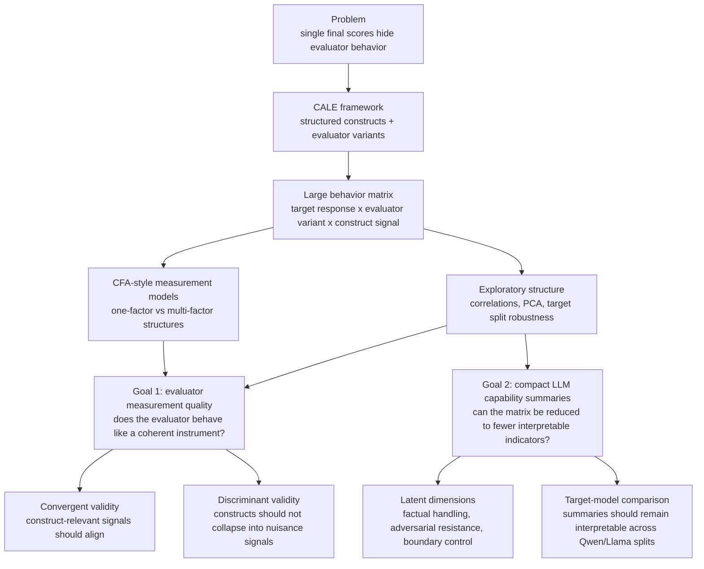

# CALE Code Track: Server Workflow And Handoff Notes

This file is the quickest way to orient a future collaborator, notebook session, or coding agent working on the code and experiment track.

For the top-level thesis split between paper writing and code work, see `../WORKSPACE_OVERVIEW.md`.

## Core Reality

The repository contains the code, but the main experiments are usually run on Galvani, not on the local laptop.

- Edit code and notebooks locally, then transfer code by the cluster-approved method. Do not run `rsync`, IDE backends, Claude, Python, notebooks, or other user workloads on login nodes.
- Run heavy Hugging Face generation and full FEVER experiments through Slurm on Galvani.
- Treat server-side `outputs/` as the source of truth for fresh experiment artifacts.
- Use Jupyter mainly for inspection, visualization, and debugging, not as the main long-running experiment process.
- Never run computation, notebooks, IDE backends, Claude, `rsync`, or automated polling on login nodes. Use login nodes only for short interactive actions such as SSH entry, `sbatch`, `scancel`, and occasional one-shot Slurm status checks.

## Common Pattern Behind Our Commands

Most commands we used follow the same structure:

1. Confirm the server project root.
2. Confirm the prepared dataset path and row count.
3. Choose a model preset or explicit model list.
4. Run generation into a response JSONL.
5. Run `experiment.py` over that JSONL into a report JSON.
6. Use the report JSON, not the response JSONL, as notebook input.
7. Save figures and tables under `figures/<report_name>/`.

The recurring distinction is important:

- `prepare_fever.py` creates CALE-ready dataset resources.
- `generate_responses.py` creates target-model responses.
- `experiment.py` creates evaluator metrics and report JSON files.
- `visualize_results.ipynb` or `visualize_fever_small_models.ipynb` consumes report JSON files.

If something fails, identify which stage failed first. Do not debug visualization by pointing it at a response JSONL, and do not debug evaluation before confirming generation produced the expected number of rows.

## Canonical Server Project Layout

Main server project directory used in current Galvani runs:

```text
/mnt/lustre/home/kelava/koh927/thesis/CALE
```

Some older notes or screenshots may also abbreviate this as:

```text
/thesis/CALE
```

Important subdirectories:

- `data/`: raw and prepared datasets
- `data/fever/prepared/dev_prepared.jsonl`: current primary FEVER dev resource
- `outputs/`: generated responses, evaluation reports, logs, and run artifacts
- `outputs/small_models_all/`: current small-model full-run output directory
- `outputs/small_models_all/logs/`: pipeline logs from the all-datasets runner
- `outputs/slurm/`: Slurm stdout/stderr logs for batch jobs
- `figures/`: exported plots or paper figures

Important scripts on the server:

- `prepare_fever.py`
- `generate_responses.py`
- `experiment.py`
- `download_fever_data.sh`
- `run_pipeline.sh`
- `run_small_models_all_datasets.sh`
- `visualize_results.ipynb`
- `visualize_fever_small_models.ipynb`

## Current Output Handoff: May 26, 2026

This is the current source-of-truth map for agents or collaborators continuing
the experiment analysis.

### Local Transfer Package Handling

When downloading Galvani outputs to the laptop, do not unzip directly into the
active `outputs/` tree. First extract into a staging/archive directory, compare
filenames, sizes, row counts, and when useful checksums, then promote only
missing or explicitly refreshed files.

The verified June 2026 transfer package is archived locally at:

```text
server_transfers/cale_transfer_2026_06_01/transfer_2026_06_01/
```

Original zip:

```text
../cale_transfer_2026_06_01.zip
```

Verified row counts:

```text
dev_prepared.jsonl: 19998 rows
fever_dev_qwen25_15b_llama32_1b_neutral_full.jsonl: 39996 rows
main heuristic behavior matrix: 239977 CSV lines including header
four matched strong-evaluator limit1000 matrices: 2001 CSV lines each including header
```

The fixed response JSONL and prepared FEVER file were missing locally and have
been promoted to their canonical local paths:

```text
data/fever/prepared/dev_prepared.jsonl
outputs/small_models_all/fever_dev_qwen25_15b_llama32_1b_neutral_full.jsonl
```

The transfer versions of existing behavior matrices and report JSON files
matched the local canonical copies and were not overwritten. Slurm `.out` and
`.err` files are provenance/debug artifacts and may be copied to
`outputs/slurm/`. `limit10` and `limit20` files in a transfer package are
smoke-test/debug artifacts and must not replace `limit1000` matched-subset
evidence.

### Fixed Target Responses

All evaluator-backend runs below evaluate the same fixed target responses:

```text
outputs/small_models_all/fever_dev_qwen25_15b_llama32_1b_neutral_full.jsonl
```

Expected rows:

```text
39996 = 19998 FEVER dev items x 2 target response models
```

Target response models:

```text
Qwen/Qwen2.5-1.5B-Instruct
meta-llama/Llama-3.2-1B-Instruct
```

These rows are inputs, not evaluator results.

### Main Heuristic Result

Primary full behavior matrix:

```text
outputs/small_models_all/fever_dev_qwen25_15b_llama32_1b_neutral_full_eval_behavior_matrix.csv
```

Expected rows:

```text
239976 = 39996 responses x 6 evaluator variants
```

Use this as the main result for CALE behavior profiles, PCA, and target-model
dominance checks. The current target-specific PCA robustness summary is:

```text
pooled PC1-PC4 variance ~= 0.613
Qwen-target-only ~= 0.624
Llama-target-only ~= 0.611
```

This suggests the heuristic full PCA structure is not obviously dominated by
one target response model.

Terminology warning: "heuristic" means a rule-based scoring backend, not a
third target model and not an average of Qwen and Llama. The heuristic backend
evaluates target responses that were already generated by Qwen2.5-1.5B and
Llama-3.2-1B. If a heuristic table shows one pooled value, that value is pooled
over target-response rows during analysis.

Target-specific outputs are under:

```text
figures/behavior_matrix_results/target_specific_robustness/
```

### Strong Evaluator Extension Jobs

These are evaluator-backend robustness extensions. They do not generate new
target responses.

Qwen2.5-7B local HF evaluator:

```text
job name: cale-str / cale-strong-eval
example job id in current run: 2582133
log pattern: outputs/slurm/cale-strong-eval-<JOBID>.err
output report:
outputs/small_models_all/fever_dev_qwen25_15b_llama32_1b_neutral_strong_qwen25_7b_limit1000_eval_report.json
output behavior matrix:
outputs/small_models_all/fever_dev_qwen25_15b_llama32_1b_neutral_strong_qwen25_7b_limit1000_eval_behavior_matrix.csv
```

Expected behavior-matrix rows if complete:

```text
2000 rows + 1 header = 2001 CSV lines
```

DeepSeek V4-Pro API evaluator:

```text
job name: cale-ds-v4
example job id in current run: 2582325
log pattern: outputs/slurm/cale-ds-v4-<JOBID>.err
output report:
outputs/small_models_all/fever_dev_qwen25_15b_llama32_1b_neutral_deepseek_v4_pro_limit1000_eval_report.json
output behavior matrix:
outputs/small_models_all/fever_dev_qwen25_15b_llama32_1b_neutral_deepseek_v4_pro_limit1000_eval_behavior_matrix.csv
```

Expected behavior-matrix rows if complete:

```text
2000 rows + 1 header = 2001 CSV lines
```

DeepSeek uses the API and does not need GPU. Qwen2.5-7B uses local HF inference
and should run on A100.

The `limit1000` files above are Qwen-target subsets when they are created from
the beginning of the fixed response JSONL. To check whether strong-evaluator
results are dominated by the target response model, submit matched Llama-target
jobs with `--start-index 19998 --limit 1000`. These jobs should write separate
files with `_llama_limit1000` in the filename and must not overwrite the
Qwen-target subset files.

### Boundary-Control Stress Subset

The boundary-control stress subset is a small hand-authored diagnostic fixture,
not a replacement for the main FEVER audit, not target-model performance
evidence, and not large-N psychometric validation. It was added because the
main neutral FEVER audit produced ceiling effects for the current
boundary-control indicators.

Current local artifacts:

```text
outputs/subsets/boundary_control_stress_handcrafted.jsonl
outputs/subsets/boundary_control_stress_handcrafted_manifest.csv
outputs/subsets/boundary_control_stress_handcrafted_heuristic_eval_report.json
outputs/subsets/boundary_control_stress_handcrafted_heuristic_eval_behavior_matrix.csv
```

Expected scale:

```text
100 hand-authored response rows
101 manifest CSV lines including header
300 behavior-matrix data rows, or 301 CSV lines including header
3 evaluator variants: generic_cale, attack_aware_cale, full_attack_aware_cale
evaluator backend: heuristic/default
```

Interpretation boundary:

- Use this subset as a boundary-control sanity/stress diagnostic for NEI
  overclaim behavior, hallucination control, and uncertainty handling.
- Do not use it as large-N psychometric evidence.
- Do not use it as a Qwen-vs-Llama target-model comparison.
- `hand_authored_boundary_target_a` and `hand_authored_boundary_target_b` are
  fixture labels, not real LLM target models.
- The subset can support claims that heuristic CALE indicators respond to
  designed boundary-control response patterns; it cannot validate boundary
  control as a latent factor by itself.
- The assertive/authoritative framing fields are controlled stress conditions
  inside this fixture, not the full controlled framing perturbation study
  reserved for future work.

Run the fixture evaluation locally or on a compute node, not on a Galvani login
node:

```bash
python experiment.py \
  --dataset outputs/subsets/boundary_control_stress_handcrafted.jsonl \
  --output outputs/subsets/boundary_control_stress_handcrafted_heuristic_eval_report.json \
  --behavior-matrix-output outputs/subsets/boundary_control_stress_handcrafted_heuristic_eval_behavior_matrix.csv \
  --variants generic_cale attack_aware_cale full_attack_aware_cale \
  --summary-only \
  --pretty
```

Verify the result:

```bash
wc -l outputs/subsets/boundary_control_stress_handcrafted.jsonl
wc -l outputs/subsets/boundary_control_stress_handcrafted_manifest.csv
wc -l outputs/subsets/boundary_control_stress_handcrafted_heuristic_eval_behavior_matrix.csv
```

Column compatibility rule: raw `experiment.py` behavior matrices may use
`variant`, while global audit tables and newer notebooks use
`evaluator_variant`. Analysis code should normalize by creating
`evaluator_variant = variant` when `evaluator_variant` is missing. If both
columns exist, treat `evaluator_variant` as canonical and check that it agrees
with `variant` before grouping.

### Targeted Validation Add-ons: June 2, 2026

These add-ons are meant to strengthen validity screening without changing the
main FEVER full-run story. They are not replacements for the global evaluator
audit or CFA notebooks.

#### Controlled Framing Fixed-Response Subset

Purpose:

```text
discriminant-validity screening for framing sensitivity
```

Design:

- Reuse the same fixed `candidate_response`.
- Clone each selected FEVER core into `neutral`, `assertive`, and
  `authoritative` prompt/framing metadata.
- Keep target responses fixed, so score shifts reflect evaluator/protocol
  sensitivity to framing, not new target generation.
- Merge and downstream analysis must use `(target_model, id)`.

Local scripts:

```text
build_controlled_framing_subset.py
analyze_controlled_framing.py
```

Current local outputs:

```text
outputs/subsets/controlled_framing_reuse_response_n300.jsonl
outputs/subsets/controlled_framing_reuse_response_n300_manifest.csv
outputs/subsets/controlled_framing_reuse_response_n300_heuristic_eval_report.json
outputs/subsets/controlled_framing_reuse_response_n300_heuristic_behavior_matrix.csv
figures/controlled_framing_n300/framing_score_shift_summary.csv
figures/controlled_framing_n300/framing_construct_shift_summary.csv
figures/controlled_framing_n300/framing_mean_abs_score_shift_heatmap.png
figures/controlled_framing_n300/framing_construct_mean_abs_shift_heatmap.png
```

Current verified scale:

```text
1800 fixed-response input rows
3600 heuristic behavior rows + 1 CSV header
300 FEVER cores x 2 target models x 3 framings
2 evaluator variants: direct_trustllm_heuristic, full_attack_aware_cale
```

Interpretation boundary:

- This is a screening test for nuisance framing sensitivity.
- It does not prove strong discriminant validity.
- It can support a cautious claim such as: "Full CALE shows small but
  measurable framing-induced construct/score shifts under fixed responses."

#### Real Boundary Hard Subset

Purpose:

```text
diagnostic validation for boundary-control indicators on real target responses
```

Design:

- Start from `figures/real_case_selection/selected_*.csv`.
- Join back to the fixed response JSONL by `(target_model, id)`.
- Deduplicate selected rows into unique real target responses.
- Preserve case categories and selection provenance.
- Do not mix this with the hand-authored boundary-control fixture.

Local scripts:

```text
build_boundary_hard_subset.py
analyze_boundary_hard_subset.py
```

Current local outputs:

```text
outputs/subsets/boundary_hard_real_subset.jsonl
outputs/subsets/boundary_hard_real_subset_manifest.csv
outputs/subsets/boundary_hard_real_subset_heuristic_eval_report.json
outputs/subsets/boundary_hard_real_subset_heuristic_behavior_matrix.csv
figures/boundary_hard_real_subset/boundary_hard_summary_by_variant_label.csv
figures/boundary_hard_real_subset/boundary_hard_hc_uh_combo_counts.csv
figures/boundary_hard_real_subset/boundary_hard_hc_uh_combo_counts.png
figures/boundary_hard_real_subset/boundary_hard_metric_profile.csv
```

Current verified scale:

```text
215 real fixed-response input rows
860 heuristic behavior rows + 1 CSV header
4 evaluator variants: direct_trustllm_heuristic, generic_cale, attack_aware_cale, full_attack_aware_cale
```

Interpretation boundary:

- This is a real-case diagnostic subset.
- It can show whether boundary-control indicators move on harder selected
  cases.
- It cannot by itself validate boundary control as a stable latent factor.

#### Measurement-Invariance Screening

Purpose:

```text
PCA-loading stability screen across evaluator backends and target-model splits
```

Local script:

```text
measurement_invariance_screening.py
```

Current local outputs:

```text
figures/measurement_invariance_screening/pca_loading_profiles.csv
figures/measurement_invariance_screening/pca_structure_summary.csv
figures/measurement_invariance_screening/pc1_loading_profiles_heatmap.png
figures/measurement_invariance_screening/loading_congruence_to_all_pooled_heatmap.png
figures/measurement_invariance_screening/target_split_loading_drift.csv
```

Interpretation boundary:

- This is not formal multi-group CFA invariance.
- Tucker phi / loading congruence is a screening statistic.
- Use it to decide whether target/backend structure is stable enough for
  cautious preliminary internal-structure language.

### Submitting Matched Strong-Evaluator Jobs

Always start from the server project root and create the Slurm log directory:

```bash
cd /mnt/lustre/home/kelava/koh927/thesis/CALE
mkdir -p outputs/slurm
```

Check available partitions if a submission fails with "No partition specified"
or "invalid partition":

```bash
sinfo
```

DeepSeek V4-Pro is an API backend. It should run on CPU and needs
`DEEPSEEK_API_KEY` in the job environment. Do not write the actual token into
the sbatch file or commit it to the repo. Export it in the interactive shell, or
pass the existing shell variable at submission time:

```bash
export DEEPSEEK_API_KEY="your_token"
sbatch --export=ALL,DEEPSEEK_API_KEY="$DEEPSEEK_API_KEY" submit_deepseek_v4_pro_llama_limit1000.sbatch
```

Template for the DeepSeek Llama-target matched job:

```bash
cat > submit_deepseek_v4_pro_llama_limit1000.sbatch <<'EOF'
#!/bin/bash
#SBATCH --job-name=cale-ds-llama
#SBATCH --partition=cpu-galvani
#SBATCH --cpus-per-task=4
#SBATCH --mem=16G
#SBATCH --time=24:00:00
#SBATCH --output=outputs/slurm/%x-%j.out
#SBATCH --error=outputs/slurm/%x-%j.err

cd /mnt/lustre/home/kelava/koh927/thesis/CALE

echo "[slurm] Job started at $(date)"
echo "[slurm] Running on $(hostname)"

source "$(conda info --base)/etc/profile.d/conda.sh"
conda activate jupyterenv

export TOKENIZERS_PARALLELISM=false

python experiment.py \
  --dataset outputs/small_models_all/fever_dev_qwen25_15b_llama32_1b_neutral_full.jsonl \
  --judge deepseek \
  --model deepseek-v4-pro \
  --variants direct_llm_judge full_attack_aware_cale \
  --repeats 1 \
  --start-index 19998 \
  --limit 1000 \
  --output outputs/small_models_all/fever_dev_qwen25_15b_llama32_1b_neutral_deepseek_v4_pro_llama_limit1000_eval_report.json \
  --behavior-matrix-output outputs/small_models_all/fever_dev_qwen25_15b_llama32_1b_neutral_deepseek_v4_pro_llama_limit1000_eval_behavior_matrix.csv \
  --summary-only \
  --pretty

echo "[slurm] Job finished at $(date)"
EOF
```

Qwen2.5-7B local HF judging needs a GPU job. Use A100 when available. Set
`HF_TOKEN` or `HUGGINGFACE_HUB_TOKEN` in the shell only if model access or
download rate limits require it; do not commit Hugging Face tokens to scripts.

Template for the Qwen2.5-7B Llama-target matched job:

```bash
cat > submit_strong_qwen25_7b_llama_limit1000.sbatch <<'EOF'
#!/bin/bash
#SBATCH --job-name=cale-qwen7b-llama
#SBATCH --partition=a100-galvani
#SBATCH --gres=gpu:1
#SBATCH --cpus-per-task=8
#SBATCH --mem=64G
#SBATCH --time=08:00:00
#SBATCH --output=outputs/slurm/%x-%j.out
#SBATCH --error=outputs/slurm/%x-%j.err

cd /mnt/lustre/home/kelava/koh927/thesis/CALE

echo "[slurm] Job started at $(date)"
echo "[slurm] Running on $(hostname)"
echo "[slurm] CUDA devices: ${CUDA_VISIBLE_DEVICES:-unset}"

source "$(conda info --base)/etc/profile.d/conda.sh"
conda activate jupyterenv

export TOKENIZERS_PARALLELISM=false
export CALE_JUDGE_MAX_NEW_TOKENS=1200
export CALE_JUDGE_DTYPE=float16
export CALE_JUDGE_DEVICE_MAP=auto

python experiment.py \
  --dataset outputs/small_models_all/fever_dev_qwen25_15b_llama32_1b_neutral_full.jsonl \
  --judge hf \
  --model Qwen/Qwen2.5-7B-Instruct \
  --variants direct_llm_judge full_attack_aware_cale \
  --repeats 1 \
  --start-index 19998 \
  --limit 1000 \
  --output outputs/small_models_all/fever_dev_qwen25_15b_llama32_1b_neutral_strong_qwen25_7b_llama_limit1000_eval_report.json \
  --behavior-matrix-output outputs/small_models_all/fever_dev_qwen25_15b_llama32_1b_neutral_strong_qwen25_7b_llama_limit1000_eval_behavior_matrix.csv \
  --summary-only \
  --pretty

echo "[slurm] Job finished at $(date)"
EOF
```

Submit the Qwen2.5-7B local HF job:

```bash
sbatch submit_strong_qwen25_7b_llama_limit1000.sbatch
```

After submission, record the job id printed by `sbatch` and confirm that the job
is running or pending:

```bash
squeue -u $USER
squeue -j <JOBID>
```

Slurm expands `%x-%j` into `<job-name>-<jobid>`, so use the real job id in log
paths:

```bash
tail -f outputs/slurm/cale-ds-llama-<JOBID>.err
tail -f outputs/slurm/cale-qwen7b-llama-<JOBID>.err
```

The `.out` files contain job start/finish metadata, host, and CUDA visibility.
The `.err` files usually contain Python progress logs, traceback diagnostics,
and evaluator parse warnings.

### Progress And Error Checks

Use the real job id, not the placeholder:

```bash
grep "Completed evaluator runs" outputs/slurm/cale-strong-eval-<JOBID>.err | tail -n 1
grep "Completed evaluator runs" outputs/slurm/cale-ds-v4-<JOBID>.err | tail -n 1
grep "Completed evaluator runs" outputs/slurm/cale-qwen7b-llama-<JOBID>.err | tail -n 1
grep "Completed evaluator runs" outputs/slurm/cale-ds-llama-<JOBID>.err | tail -n 1
grep -i "Invalid JSON\|parseable\|failed to produce\|Traceback\|KeyError" outputs/slurm/cale-strong-eval-<JOBID>.err | tail
grep -i "Invalid JSON\|parseable\|failed to produce\|Traceback\|KeyError" outputs/slurm/cale-ds-v4-<JOBID>.err | tail
grep -i "Invalid JSON\|parseable\|failed to produce\|Traceback\|KeyError" outputs/slurm/cale-qwen7b-llama-<JOBID>.err | tail
grep -i "Invalid JSON\|parseable\|failed to produce\|Traceback\|KeyError" outputs/slurm/cale-ds-llama-<JOBID>.err | tail
```

After a job finishes, verify row counts:

```bash
wc -l outputs/small_models_all/fever_dev_qwen25_15b_llama32_1b_neutral_strong_qwen25_7b_limit1000_eval_behavior_matrix.csv
wc -l outputs/small_models_all/fever_dev_qwen25_15b_llama32_1b_neutral_deepseek_v4_pro_limit1000_eval_behavior_matrix.csv
wc -l outputs/small_models_all/fever_dev_qwen25_15b_llama32_1b_neutral_strong_qwen25_7b_llama_limit1000_eval_behavior_matrix.csv
wc -l outputs/small_models_all/fever_dev_qwen25_15b_llama32_1b_neutral_deepseek_v4_pro_llama_limit1000_eval_behavior_matrix.csv
```

Each matched strong-evaluator `limit1000` behavior matrix should have:

```text
2000 rows + 1 header = 2001 CSV lines
```

Confirm that Qwen-target and Llama-target subsets really evaluate different
target response models:

```bash
python - <<'PY'
import glob
import pandas as pd

for path in sorted(glob.glob("outputs/small_models_all/*limit1000*behavior_matrix.csv")):
    df = pd.read_csv(path)
    print("\n" + path)
    print("target models:")
    print(df["model_name"].value_counts())
    print("evaluator variants:")
    print(df["variant"].value_counts())
PY
```

### Analysis Notebooks

Main heuristic/target-specific analysis:

```text
behavior_matrix_results.ipynb
```

Global evaluator/backend analysis:

```text
strong_evaluator_results.ipynb
```

Despite the historical filename, this notebook is now the global evaluator
audit. It covers the rule-based full run plus strong-evaluator subsets. Read it
as a three-layer dashboard:

```text
target_model:
  Qwen/Qwen2.5-1.5B-Instruct
  meta-llama/Llama-3.2-1B-Instruct

evaluator_backend:
  Rule-based scoring backend (non-LLM)
  Qwen2.5-7B local HF judge
  Qwen3-14B local HF judge
  Gemma3-12B local HF judge
  DeepSeek V4-Pro API judge

evaluator_variant:
  baseline_binary
  baseline_likert
  direct_trustllm_heuristic
  direct_llm_judge
  generic_cale
  attack_aware_cale
  full_attack_aware_cale
```

It outputs combined backend tables, direct-vs-full-CALE comparisons, behavior
profile heatmaps, protocol-level PCA/top-loading summaries, and target-model
dominance checks under:

```text
figures/global_evaluator_audit/
```

Core interpretation question:

```text
Does CALE's diagnostic structure remain visible across evaluator backends, and
is that structure robust to Qwen-target-only vs Llama-target-only splits?
```

The notebook intentionally includes weaker/control evaluator protocols. Treat
`baseline_binary`, `baseline_likert`, `direct_trustllm_heuristic`, and
`generic_cale` as protocol-ablation controls, not as interchangeable judges in a
single leaderboard. The main PCA outputs to inspect are:

```text
figures/global_evaluator_audit/protocol_backend_pca_summary.csv
figures/global_evaluator_audit/protocol_backend_pca_variance_pooled.png
figures/global_evaluator_audit/protocol_backend_pca_pc1_by_target_split.png
figures/global_evaluator_audit/protocol_backend_pca_pc1_pc4_by_target_split.png
figures/global_evaluator_audit/target_model_dominance_pca_summary.csv
figures/global_evaluator_audit/target_model_dominance_pc1_variance.png
figures/global_evaluator_audit/target_model_dominance_variance.png
```

The main split-aware construct/profile outputs are:

```text
figures/global_evaluator_audit/full_cale_construct_profile_by_backend_protocol_target_split.csv
figures/global_evaluator_audit/full_cale_construct_profile_compact.csv
figures/global_evaluator_audit/full_cale_construct_profile_backend_protocol_target_split_heatmap.png
figures/global_evaluator_audit/full_cale_construct_profile_qwen_minus_llama.csv
figures/global_evaluator_audit/full_cale_construct_profile_qwen_minus_llama_heatmap.png
figures/global_evaluator_audit/backend_pair_score_alignment_by_target_split.csv
figures/global_evaluator_audit/schema_missingness_by_run_target_split.csv
figures/global_evaluator_audit/proxy_specific_diagnostics_by_run_target_split.csv
```

### Minimal Handoff Checklist For Future Agents

When a future agent or notebook session resumes this project, preserve these
outputs first:

```text
1. Fixed response input:
   outputs/small_models_all/fever_dev_qwen25_15b_llama32_1b_neutral_full.jsonl

2. Main heuristic behavior matrix:
   outputs/small_models_all/fever_dev_qwen25_15b_llama32_1b_neutral_full_eval_behavior_matrix.csv

3. Target-specific robustness directory:
   figures/behavior_matrix_results/target_specific_robustness/

4. Qwen2.5-7B evaluator subsets:
   outputs/small_models_all/fever_dev_qwen25_15b_llama32_1b_neutral_strong_qwen25_7b_limit1000_eval_report.json
   outputs/small_models_all/fever_dev_qwen25_15b_llama32_1b_neutral_strong_qwen25_7b_limit1000_eval_behavior_matrix.csv
   outputs/small_models_all/fever_dev_qwen25_15b_llama32_1b_neutral_strong_qwen25_7b_llama_limit1000_eval_report.json
   outputs/small_models_all/fever_dev_qwen25_15b_llama32_1b_neutral_strong_qwen25_7b_llama_limit1000_eval_behavior_matrix.csv

5. DeepSeek V4-Pro evaluator subsets:
   outputs/small_models_all/fever_dev_qwen25_15b_llama32_1b_neutral_deepseek_v4_pro_limit1000_eval_report.json
   outputs/small_models_all/fever_dev_qwen25_15b_llama32_1b_neutral_deepseek_v4_pro_limit1000_eval_behavior_matrix.csv
   outputs/small_models_all/fever_dev_qwen25_15b_llama32_1b_neutral_deepseek_v4_pro_llama_limit1000_eval_report.json
   outputs/small_models_all/fever_dev_qwen25_15b_llama32_1b_neutral_deepseek_v4_pro_llama_limit1000_eval_behavior_matrix.csv

6. Qwen3-14B evaluator subsets:
   outputs/small_models_all/fever_dev_qwen25_15b_llama32_1b_neutral_qwen3_14b_limit1000_eval_report.json
   outputs/small_models_all/fever_dev_qwen25_15b_llama32_1b_neutral_qwen3_14b_limit1000_eval_behavior_matrix.csv
   outputs/small_models_all/fever_dev_qwen25_15b_llama32_1b_neutral_qwen3_14b_llama_limit1000_eval_report.json
   outputs/small_models_all/fever_dev_qwen25_15b_llama32_1b_neutral_qwen3_14b_llama_limit1000_eval_behavior_matrix.csv

7. Gemma3-12B evaluator subsets:
   outputs/small_models_all/fever_dev_qwen25_15b_llama32_1b_neutral_gemma3_12b_limit1000_eval_report.json
   outputs/small_models_all/fever_dev_qwen25_15b_llama32_1b_neutral_gemma3_12b_limit1000_eval_behavior_matrix.csv
   outputs/small_models_all/fever_dev_qwen25_15b_llama32_1b_neutral_gemma3_12b_llama_limit1000_eval_report.json
   outputs/small_models_all/fever_dev_qwen25_15b_llama32_1b_neutral_gemma3_12b_llama_limit1000_eval_behavior_matrix.csv

8. Analysis notebooks:
   behavior_matrix_results.ipynb
   strong_evaluator_results.ipynb
   cfa_behavior_model.ipynb
```

Do not treat strong-evaluator subsets as new target-model generations. They
reuse the fixed response input and only change the evaluator backend.

## Required Workflow

## Psychometric Validity Workflow: CALE Family

Current research framing:

```text
Do CALE-family evaluator variants produce a stable, interpretable measurement
structure, and do the resulting construct signals show convergent and
discriminant validity?
```

Use this framing instead of a leaderboard framing. **Higher score is not
automatically better measurement quality; PCA variance is
structure/concentration evidence, not leaderboard evidence.** A higher
`final_score` is not enough evidence that a CALE variant or evaluator backend
is better.

### Research Logic Flow

Use this flow when explaining the project to a future agent, collaborator, or
notebook reader:



This flow has two deliverables:

```text
Goal 1:
  measurement_quality_summary.csv
  one row per evaluator backend/protocol/split where possible
  evidence: PCA structure, backend agreement, target split sensitivity,
            convergent/discriminant validity screening

Goal 2:
  compact_capability_summary.csv
  fixed evaluator backend + fixed CALE protocol before comparing target models
  evidence: construct means or latent summaries for factual handling,
            adversarial resistance, and boundary/control behavior
```

### Layer Separation

Keep these three layers separate in every table and plot:

```text
target_model:
  the model that generated the candidate response
  examples: Qwen/Qwen2.5-1.5B-Instruct, meta-llama/Llama-3.2-1B-Instruct

evaluator_backend:
  the judge implementation/model that scores the response
  examples: heuristic/default, Qwen/Qwen2.5-7B-Instruct, deepseek-v4-pro
  note: heuristic/default is a rule-based scoring backend, not Qwen/Llama
        averaging and not an LLM

evaluator_variant:
  the evaluation protocol or CALE family member
  examples: direct_llm_judge, direct_trustllm_heuristic, generic_cale,
            attack_aware_cale, full_attack_aware_cale
```

`direct` means a holistic single-label judge with reference information. It
does not produce CALE construct-level indicators. For the heuristic backend,
the direct baseline is `direct_trustllm_heuristic`, implemented by
`DirectHeuristicJudge(mode="trustllm")` without an LLM call. For model-based
evaluator backends, the direct baseline is `direct_llm_judge`, implemented by
the selected HF/API model using `build_direct_judge_prompt(...)`.

Use this mapping in notebooks and tables:

```text
direct_trustllm_heuristic:
  role: direct holistic baseline
  backend: heuristic/default only
  implementation: rule-based TrustLLM-style proxy
  not equivalent to: direct_llm_judge

direct_llm_judge:
  role: direct holistic baseline
  backend: hf/openai/deepseek model-based judges
  implementation: LLM prompt through the selected evaluator backend

full_attack_aware_cale:
  role: structured CALE protocol
  backend: can be heuristic, hf, openai, or deepseek
```

### Primary Psychometric Evidence

Use the heuristic full behavior matrix as the primary CALE-family
psychometrics input:

```text
outputs/small_models_all/fever_dev_qwen25_15b_llama32_1b_neutral_full_eval_behavior_matrix.csv
```

This is the only current full-sample result with both target models and the
full CALE ladder:

```text
generic_cale -> attack_aware_cale -> full_attack_aware_cale
```

The main psychometric notebook is:

```text
cfa_behavior_model.ipynb
```

It now writes family psychometrics outputs under:

```text
figures/cfa_behavior_model/family_psychometrics/
```

Core tables to inspect:

```text
cfa_family_convergent_reliability_ave_cr.csv
cfa_family_discriminant_validity_fornell_larcker.csv
cfa_family_indicator_signal_correlations.csv
cfa_family_nuisance_vs_construct_relevant_summary.csv
all_cases_fit_indices.csv
all_cases_standardized_loadings.csv
all_cases_factor_correlations.csv
```

### Validity Logic

Convergent validity means construct-relevant signals should align:

```text
intended indicators load on intended factors
PCA loading clusters resemble CFA factors
factor/indicator scores correlate with final_score or relevant proxy variables
```

Discriminant validity means constructs are related but not redundant and are
not mainly driven by nuisance signals:

```text
factor correlations should not approach 1
Fornell-Larcker-style checks should not fail systematically
construct indicators should not correlate more strongly with target identity,
reference label, domain, risk level, or framing style than with construct-
relevant signals
```

Treat these as screening checks. Strong psychometric claims would require
ordinal CFA or WLSMV, human/expert criteria, and formal measurement invariance.

### Global Measurement Dashboard

Use:

```text
strong_evaluator_results.ipynb
```

as the global measurement dashboard, not only as a strong-evaluator notebook.
It now writes under:

```text
figures/global_evaluator_audit/
```

It should answer:

```text
Which target_model x evaluator_backend x evaluator_variant combinations exist?
How does direct compare with full CALE within each backend?
How does the CALE family ladder behave in the heuristic full run?
Do backend robustness subsets preserve similar full CALE construct structure?
Is any result dominated by one target-model split?
```

Do not interpret cross-backend absolute score means as a calibrated leaderboard.

### Paper-Ready Local Analysis Outputs

As of 2026-06-01, do not launch new server experiments just to improve the
paper story. The current analysis step is local notebook polishing: convert the
global audit outputs into paper-ready figures and tables.

Run `strong_evaluator_results.ipynb` locally after the server matrices have
been downloaded. The final paper-facing section should write:

```text
figures/global_evaluator_audit/paper_table_measurement_quality_core.csv
figures/global_evaluator_audit/paper_goal1_measurement_quality_dashboard.png
figures/global_evaluator_audit/paper_table_compact_capability_core.csv
figures/global_evaluator_audit/paper_goal2_compact_target_capability_heatmap.png
figures/global_evaluator_audit/paper_backend_agreement_heatmap.png
figures/global_evaluator_audit/paper_target_split_sensitivity_heatmap.png
```

Run `cfa_behavior_model.ipynb` locally for the CFA-style claim summary. The
paper-facing CFA export should be:

```text
figures/cfa_behavior_model/family_psychometrics/validity/paper_cfa_claim_readiness.csv
```

Interpretation boundary for the paper: use the heuristic full run as the
large-N internal-structure evidence, and use Qwen2.5-7B / Qwen3-14B /
Gemma3-12B / DeepSeek V4-Pro matched subsets as backend robustness and
backend-disagreement evidence. Do not present these outputs as a calibrated
evaluator leaderboard.

As of the June 2 local refresh, `strong_evaluator_results.ipynb` has been rerun
with five evaluator backends:

```text
figures/global_evaluator_audit/run_registry.csv: 9 runs
figures/global_evaluator_audit/combined_available_behavior_matrix.csv: 255,976 behavior rows
figures/global_evaluator_audit/paper_table_measurement_quality_core.csv: 5 full-CALE backend rows
figures/global_evaluator_audit/paper_table_compact_capability_core.csv: 10 rows = 5 backends x 2 target splits
```

Full-CALE pooled PC1-PC4 cumulative variance after this refresh:

```text
Rule-based heuristic: 0.650
Qwen2.5-7B judge: 0.831
Qwen3-14B judge: 0.837
Gemma3-12B judge: 0.852
DeepSeek V4-Pro: 0.909
```

These values are structure/concentration evidence, not evaluator-quality
rankings.

### 1. Enter The Server Project

```bash
cd /mnt/lustre/home/kelava/koh927/thesis/CALE
```

### 2. Check Whether Responses Already Exist

Before using A100 time, check whether the GPU-heavy response JSONL already
exists. Generation is the only A100-heavy stage; `experiment.py`,
`visualize_behavior_matrix.py`, and `analyze_behavior_matrix.py` are CPU-friendly.

The current reusable neutral full FEVER response file is:

```bash
ls -lh outputs/small_models_all/fever_dev_qwen25_15b_llama32_1b_neutral_full.jsonl
wc -l outputs/small_models_all/fever_dev_qwen25_15b_llama32_1b_neutral_full.jsonl
```

Expected rows:

```text
39996
```

This is `19998` FEVER dev items times two target models. If this file exists,
do not regenerate neutral full responses on A100; run `experiment.py` directly
on CPU and export the report plus behavior matrix.

After the behavior matrix exists, run target-specific robustness analysis on
CPU:

```bash
python run_target_specific_behavior_analysis.py \
  --input outputs/small_models_all/fever_dev_qwen25_15b_llama32_1b_neutral_full_eval_behavior_matrix.csv \
  --output-dir figures/behavior_target_specific_neutral_full
```

This repeats the behavior profile and CALE-only PCA summaries for
`pooled_all_targets`, `target_qwen25_15b_only`, and `target_llama32_1b_only`.

### Optional Strong Evaluator Smoke Run

After the target-specific robustness check, a stronger evaluator can be added
without regenerating target responses. This changes only the evaluator backend:

This command is a historical/debug smoke example. It is not the current input
registry for `strong_evaluator_results.ipynb`. The current global audit uses the
matched `limit1000` Qwen-target and Llama-target files listed in the handoff
checklist above.

```bash
python experiment.py \
  --dataset outputs/small_models_all/fever_dev_qwen25_15b_llama32_1b_neutral_full.jsonl \
  --judge hf \
  --model Qwen/Qwen2.5-7B-Instruct \
  --variants direct_llm_judge generic_cale attack_aware_cale full_attack_aware_cale \
  --repeats 1 \
  --limit 100 \
  --output outputs/small_models_all/fever_dev_qwen25_15b_llama32_1b_neutral_strong_qwen25_7b_eval_report.json \
  --behavior-matrix-output outputs/small_models_all/fever_dev_qwen25_15b_llama32_1b_neutral_strong_qwen25_7b_eval_behavior_matrix.csv \
  --summary-only \
  --pretty
```

Start with a small limit because strong-evaluator inference generates one judge
response per evaluated row. Increase the limit only after checking runtime,
JSON-parse stability, and output quality.
If the model is gated or downloads are slow, set `HF_TOKEN` or
`HUGGINGFACE_HUB_TOKEN` in the shell or sbatch script. The HF direct and
structured judges share one cached model/tokenizer instance within the same
process, so mixed strong-evaluator variants should not reload the 7B evaluator
for every variant type.

### 3. Check Data Readiness

```bash
ls -lh data/fever/prepared/dev_prepared.jsonl
wc -l data/fever/prepared/dev_prepared.jsonl
```

Expected current FEVER dev rows:

```text
19998
```

If the prepared file is missing, run:

```bash
bash download_fever_data.sh
```

The download script downloads raw FEVER data and prepares train/dev files. It should not delete the raw FEVER files.

### 4. Run A Smoke Test Before Full Runs

Use smoke mode to verify model access, GPU visibility, output names, and JSON format:

```bash
CALE_RUN_MODE=smoke \
CALE_LIMIT=20 \
CALE_MODEL_PRESET=open_small \
CALE_BATCH_SIZE=8 \
CALE_RESUME=1 \
bash run_pipeline.sh
```

For quick Qwen-only debugging when Llama access is uncertain:

```bash
CALE_RUN_MODE=smoke \
CALE_LIMIT=20 \
CALE_MODEL_PRESET=qwen_only \
CALE_BATCH_SIZE=8 \
bash run_pipeline.sh
```

### 5. Submit Long Runs Through Slurm

Preferred full small-model run on A100:

```bash
sbatch submit_small_models_a100.sbatch
```

If launching manually inside an allocated job, the core command is:

```bash
CALE_RUN_MODE=full \
CALE_MODEL_PRESET=open_small \
CALE_BATCH_SIZE=64 \
CALE_RESUME=1 \
CALE_OUTPUT_DIR=outputs/small_models_all \
bash run_small_models_all_datasets.sh
```

Current `open_small` preset:

```text
Qwen/Qwen2.5-1.5B-Instruct
meta-llama/Llama-3.2-1B-Instruct
```

Expected FEVER dev output rows:

```text
19998 items x 2 models = 39996 response JSONL rows
```

### 6. Check Progress Without Polling Login Nodes

Do not leave `watch`, `tail -f`, repeated `squeue`, repeated `grep`, or custom polling loops running on a login node. Use occasional one-shot checks, or inspect logs from a compute allocation/Jupyter session that is already running on a compute node.

One-shot Slurm queue check:

```bash
squeue -u $USER
```

One-shot Slurm log peek:

```bash
tail -n 80 outputs/slurm/cale-small-<JOB_ID>.out
```

One-shot pipeline log peek:

```bash
tail -n 80 outputs/small_models_all/logs/fever_dev_neutral_full_eval.log
```

Check generation progress:

```bash
wc -l outputs/small_models_all/fever_dev_qwen25_15b_llama32_1b_neutral_full.jsonl
ls -lh outputs/small_models_all/fever_dev_qwen25_15b_llama32_1b_neutral_full.jsonl
```

Check GPU use:

```bash
nvidia-smi
```

Run `nvidia-smi` inside the allocated compute job or compute-node Jupyter session, not on a login node.

Healthy logs should show:

- `cuda_available=True`
- visible CUDA device name
- actual model device such as `cuda:0`
- batch size
- expected output rows
- elapsed time, ETA, and generation rate

### 7. Use The Correct Visualization Input

Use the report JSON:

```python
RESULTS_PATH = Path("outputs/small_models_all/fever_dev_qwen25_15b_llama32_1b_neutral_full_eval_report.json")
```

Do not use:

```text
outputs/small_models_all/fever_dev_qwen25_15b_llama32_1b_neutral_full.jsonl
```

That file is the response JSONL from generation, not the final evaluation report.

For the current FEVER small-model result, use:

```text
visualize_fever_small_models.ipynb
```

It creates:

- model comparison figures
- evaluator-variant comparison figures
- model x evaluator heatmaps
- FEVER reference-label behavior plots
- NEI overclaim analysis
- Source Faithfulness and construct-subscore plots
- model-disagreement tables
- paper-table CSV exports

## Resource Policy And Practical Choices

Use Slurm for GPU work.

- A100 is best for full generation runs and larger batch sizes.
- 2080 Ti is best for smoke tests, small-model debugging, and short notebook sessions.
- CPU Jupyter is best for result inspection, notebook editing, and visualization that does not need GPU.

Do not rely on an SSH foreground process for long runs. If a command is running in the foreground and the laptop sleeps or disconnects, the job may stop. Use `sbatch` for long experiments.

If a foreground generation was interrupted, resume with:

```bash
CALE_RESUME=1 bash run_small_models_all_datasets.sh
```

## Jupyter Usage

Local launcher scripts live one directory above this code folder:

- `../start_galvani_jupyter.command`: opens one unified launcher menu
- `../stop_galvani_jupyter.command`: stops the saved Jupyter Slurm session

The unified launcher first asks which resource profile you want:

- `2080 visualization`: notebook inspection, quick debugging, and general plotting
- `2080 experiment`: notebook sessions that need to launch or monitor actual model runs on 2080
- `A100`: heavier notebook work or cases where 2080 VRAM is not enough
- `CPU`: visualization, table inspection, and notebook editing without GPU

It then asks for a walltime with A/B/C/D choices and recommended defaults.

Default resource bundles are:

`2080 visualization`

```text
1 GPU, 2 CPU, 12G memory, 2 hours
```

`2080 experiment`

```text
1 GPU, 8 CPU, 48G memory, 8 hours
```

`A100`

```text
1 GPU, 8 CPU, 64G memory, 4 hours
```

`CPU`

```text
0 GPU, 4 CPU, 16G memory, 2 hours
```

For scripting, you can still skip the menu by setting `GALVANI_PROFILE_KIND` and optionally `GALVANI_WALLTIME` before launching `start_galvani_jupyter.sh`.

To comply with the login-node policy, the launcher submits the Slurm job and exits. It does not poll the login node while waiting for Slurm or Jupyter readiness. After a manual one-shot `squeue` check shows the job is `RUNNING`, run:

```bash
../connect_galvani_jupyter.command
```

If the connector says the token is not ready yet, wait a little and run it once again. Do not wrap it in `watch` or another polling loop.

If Jupyter is pending with `Reason=Resources`, this is usually not a script bug. It means Slurm cannot currently satisfy the requested resource bundle. Cancel unneeded pending Jupyter jobs with:

```bash
scancel <JOB_ID>
```

## Hugging Face Access

Llama and Gemma models may require accepting the model license and setting a Hugging Face token.

Set the token on the server shell before submitting jobs:

```bash
export HF_TOKEN="your_token"
```

Do not paste tokens into chat or commit them to files. If a token was exposed, revoke or rotate it.

## Output Conventions

Typical full FEVER small-model output paths:

```text
outputs/small_models_all/fever_dev_qwen25_15b_llama32_1b_neutral_full.jsonl
outputs/small_models_all/fever_dev_qwen25_15b_llama32_1b_neutral_full_eval_report.json
```

Typical output pattern:

- response generations: `outputs/**/*.jsonl`
- CALE evaluation reports: `outputs/**/*_report.json`
- Slurm logs: `outputs/slurm/*.out` and `outputs/slurm/*.err`
- pipeline logs: `outputs/small_models_all/logs/*.log`
- notebook figures: `figures/<report_stem>/`

## Decision Rules

Use this checklist before changing commands:

- If the dataset path ends in `prepared/*.jsonl` and lacks `candidate_response`, run `generate_responses.py` first.
- If the file is a response JSONL with `candidate_response`, run `experiment.py`.
- If the file is `*_report.json`, use it in visualization notebooks.
- If the task is real case selection from existing fixed responses, use `select_real_cases.py` locally with the fixed response JSONL and `figures/global_evaluator_audit/combined_available_behavior_matrix.csv`.
- For real case selection, merge on `(target_model, id)`, not `id` alone, because every FEVER id appears for both target models.
- If a run will take more than a few minutes, submit it with Slurm.
- If only making plots, prefer CPU Jupyter or a local notebook.
- If GPU memory is low, reduce `CALE_BATCH_SIZE`.
- If the process was interrupted, use `CALE_RESUME=1`.
- If Llama/Gemma download fails, check `HF_TOKEN` and model license access.

## Local Real Case Selection

When the fixed response JSONL is available locally, real diagnostic examples can be selected without new server jobs:

```bash
cd "/Users/macbook1/Documents/thesis/CALE code"
".cale-analysis-venv/bin/python" select_real_cases.py
```

Default inputs:

- `outputs/small_models_all/fever_dev_qwen25_15b_llama32_1b_neutral_full.jsonl`
- `figures/global_evaluator_audit/combined_available_behavior_matrix.csv`

Default outputs:

- `figures/real_case_selection/real_case_selection_selected_cases.csv`
- `figures/real_case_selection/selected_cases_readable.md`
- `figures/real_case_selection/selected_nei_boundary_failure.csv`
- `figures/real_case_selection/selected_boundary_indicator_mismatch.csv`
- `figures/real_case_selection/selected_backend_disagreement.csv`
- `figures/real_case_selection/selected_direct_vs_full_shift.csv`
- `figures/real_case_selection/selected_representative_factual_handling.csv`
- `figures/real_case_selection/nei_boundary_failure_rate_by_backend_target.png`
- `figures/real_case_selection/boundary_indicator_combo_counts_by_backend.png`
- `figures/real_case_selection/top_backend_disagreement_score_heatmap.png`

Interpret these outputs as qualitative diagnostic examples and visualization support. They are useful for paper/PPT case illustrations and for checking whether the aggregate audit has interpretable instances underneath it. They are not a replacement for the large-N behavior matrix, PCA, CFA-style summaries, or matched backend audit.

## Recommended Handoff Fields

When finishing a run, append or update the following information somewhere convenient in this file or in a dated lab note:

- date
- server name or login target
- dataset used
- model preset or exact model names
- key environment variables
- command launched
- Slurm job id, if applicable
- output directory
- response JSONL path
- final report JSON path
- figure directory
- whether the run completed successfully
- next recommended step

## Suggested Status Template

Copy this block when recording a new run:

```md
## Run Status

- Date:
- Server: Galvani
- Working directory on server: /mnt/lustre/home/kelava/koh927/thesis/CALE
- Dataset:
- Models / preset:
- Command:
- Slurm job id:
- Main outputs:
- Response JSONL:
- Latest report JSON:
- Figures exported:
- Current state: planned | running | finished | failed
- Notes:
- Next step:
```

## Current Known Successful Run

- Date: 2026-05-07
- Server: Galvani A100
- Dataset: FEVER dev, `data/fever/prepared/dev_prepared.jsonl`
- Rows: 19998
- Models / preset: `open_small`
- Models: `Qwen/Qwen2.5-1.5B-Instruct`, `meta-llama/Llama-3.2-1B-Instruct`
- Framing: `neutral`
- Batch size: 64
- Response rows: 39996
- Response JSONL: `outputs/small_models_all/fever_dev_qwen25_15b_llama32_1b_neutral_full.jsonl`
- Report JSON: `outputs/small_models_all/fever_dev_qwen25_15b_llama32_1b_neutral_full_eval_report.json`
- Recommended visualization: `visualize_fever_small_models.ipynb`

## Recommended One-Sentence Summary For Future Agents

> The CALE codebase is edited locally, but full experiments run on Galvani through Slurm; always verify server-side `outputs/`, use response JSONL only for `experiment.py`, and use `*_report.json` files for visualization notebooks.
